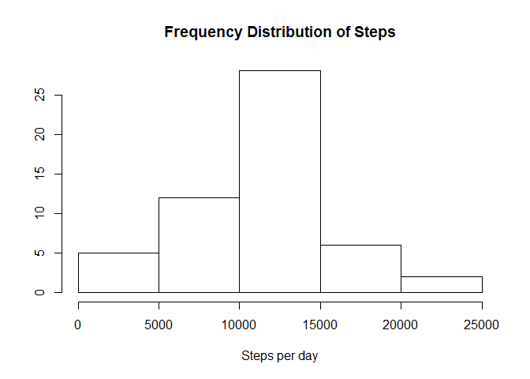
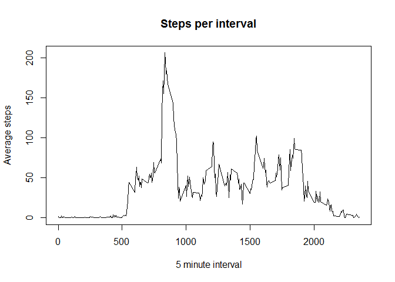
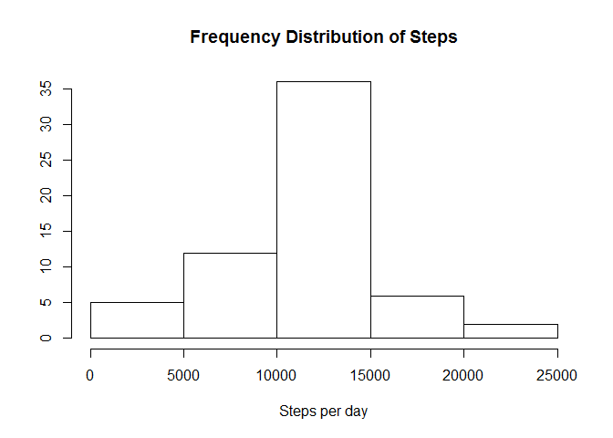
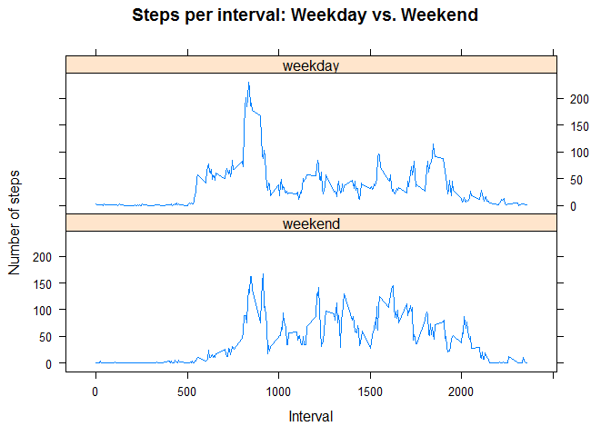

# Reproducible Research: Peer Assessment 1


## Loading and preprocessing the data

```r
files <- list.files()
if(!"activity.csv" %in% files){
        temp <- tempfile()
        address <- "http://d396qusza40orc.cloudfront.net/repdata%2Fdata%2Factivity.zip"
        download.file(address,temp, mode="wb")
        unzip(temp, "activity.csv")
        unlink(temp)
}
activity <- read.csv("activity.csv", header = TRUE, stringsAsFactors = FALSE)
activity$date <- as.Date(activity$date)
head(activity)
```

```
##   steps       date interval
## 1    NA 2012-10-01        0
## 2    NA 2012-10-01        5
## 3    NA 2012-10-01       10
## 4    NA 2012-10-01       15
## 5    NA 2012-10-01       20
## 6    NA 2012-10-01       25
```


## What is mean total number of steps taken per day?
If we remove (we don't ignore the values or they will be treated as 0's) the missing values, we can calulate the total steps taken per day and plot this as a histogram.  


```r
activity2 <- na.omit(activity)
activityByDay <- tapply(activity2$steps, activity2$date, sum, na.rm = TRUE)
hist(activityByDay, main = "Frequency Distribution of Steps",
     xlab = "Steps per day", ylab = NULL)
```

 

And calculate the mean and median steps taken per day.


```r
mean(activityByDay)
```

```
## [1] 10766.19
```

```r
median(activityByDay)
```

```
## [1] 10765
```

## What is the average daily activity pattern?
We can examine the daily activity pattern by averaging the steps taken per time interval and plot this.


```r
activityByInt <- aggregate(activity$steps, by = list(activity$interval),
                           FUN = mean, na.rm = TRUE, na.action = NULL)
names(activityByInt)<- c("interval", "mean")

plot(x=activityByInt[, 1], y=activityByInt[, 2], main="Steps per interval",
     xlab="5 minute interval", ylab="Average steps", type = "l")
```

 

## Imputing missing values
We can caculate how many NA values and we should deal with these, we will use the mean steps per interval in the missing data.

```r
length(which(is.na(activity)))
```

```
## [1] 2304
```

```r
for(i in 1:nrow(activity)){
        if(is.na(activity$steps[i])){
                activity$steps[i] <- 
                        activityByInt$mean[
                                which(activityByInt$interval
                                               == activity$interval[i])]
        }
}
```

And use this new data to examine the data as we did intially to look at steps per day histogram as well as mean and median.  


```r
activityByDay2 <- tapply(activity$steps, activity$date, sum, na.rm = TRUE)
hist(activityByDay2, main = "Frequency Distribution of Steps",
     xlab = "Steps per day", ylab = NULL)
```

 

```r
mean(activityByDay2)
```

```
## [1] 10766.19
```

```r
median(activityByDay2)
```

```
## [1] 10766.19
```
As expected, filling in the missing NA values with the mean leaves the mean unchanged, however, the median is pulled to the mean. The distribution (histogram) is similar to omitting the values and omitting the values is certainly a more appropriate analysis.


## Are there differences in activity patterns between weekdays and weekends?
We can also compare weekend verses weekday actvitiy patterns by comparing the steps per interval by weekend verses week days.

```r
weekend <- c("Saturday", "Sunday")
activity$weekday <- factor((weekdays(activity$date) %in% weekend), 
                              levels=c(TRUE, FALSE), labels=c('weekend', 'weekday'))
actByIntWkday <- aggregate(steps ~ interval + weekday, activity, mean)

require(lattice)
```

```
## Loading required package: lattice
```

```r
xyplot(steps ~ interval | factor(weekday), data=actByIntWkday,
       type="l",
       layout = c(1,2),
       main= "Steps per interval: Weekday vs. Weekend",
       xlab= "Interval",
       ylab= "Number of steps",
)
```

 

Weekend days have more sustained activity during awake hours.  
